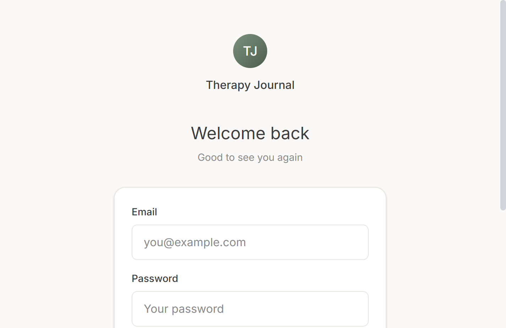
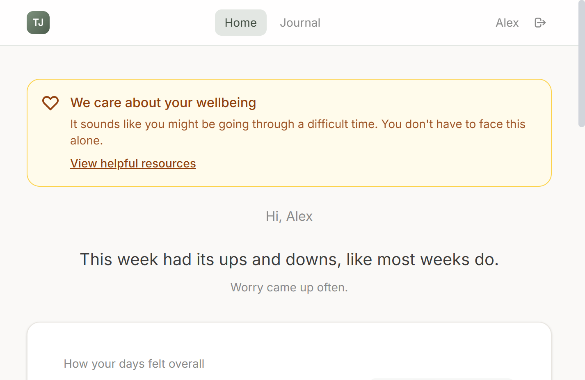
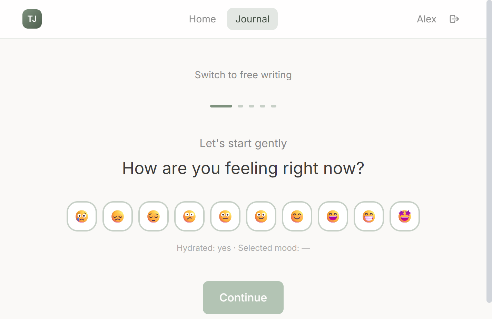
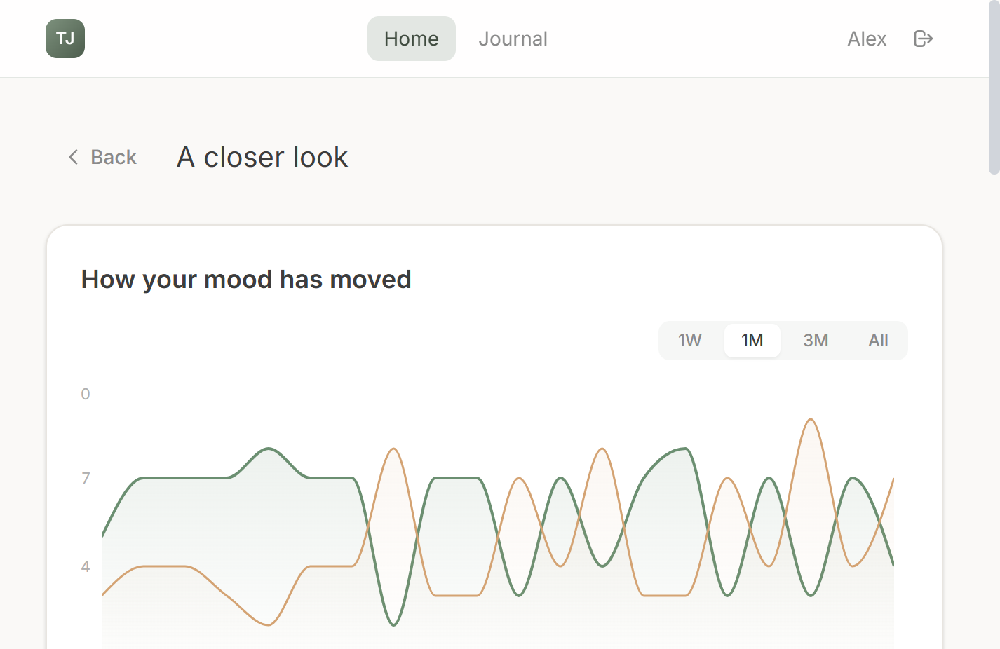
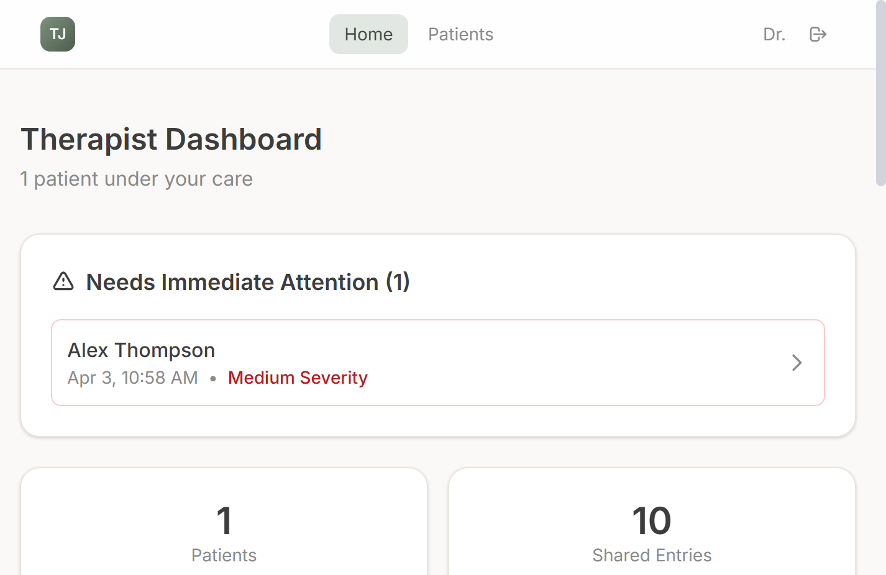
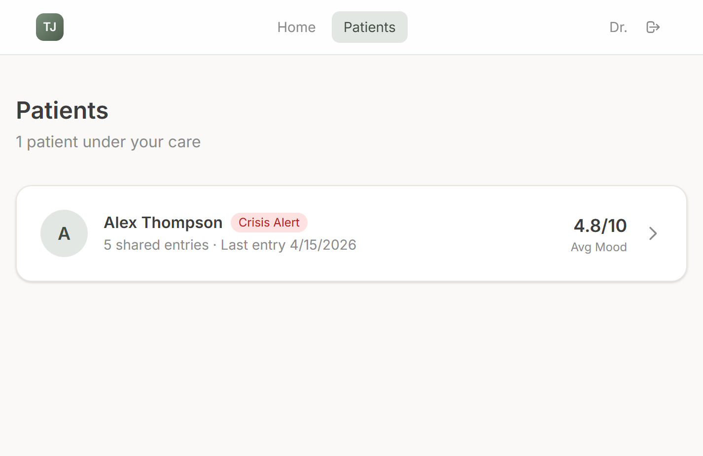
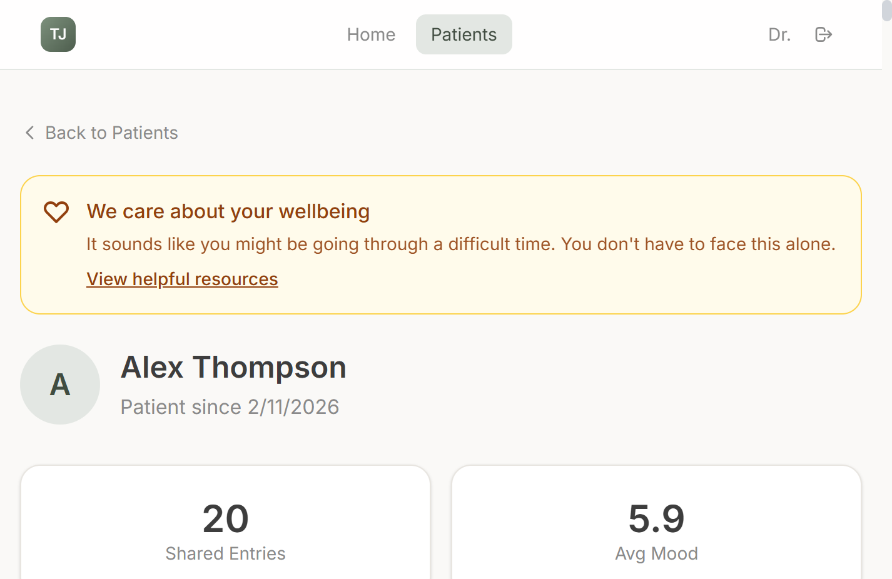

# AI Therapy Journal

A web-based therapy journaling platform where patients write daily entries, AI extracts mood/symptoms, and therapists view shared entries with visualizations. Built with a warm therapeutic aesthetic, strict safety boundaries, and HIPAA-aligned privacy controls.

## Features

### For Patients
- **Daily Journaling** - Free-text entries with optional guided prompts
- **Mood & Symptom Tracking** - AI extracts emotional indicators with confidence scores
- **Structured Fields** - Track sleep, medication, and energy levels
- **AI Chat Companion** - Supportive chat with retrieval-based context
- **Dashboard Visualizations** - Mood trends, symptom frequency, sleep correlation
- **Privacy Controls** - Choose what to share with your therapist

### For Therapists
- **Patient Overview** - See all assigned patients with mood snapshots
- **Shared Entries** - View entries patients have chosen to share
- **Data Visualizations** - Trend analysis for each patient
- **Crisis Alerts** - Notifications when concerning language is detected
- **HIPAA Logging** - All access is logged for compliance

## Website walkthrough

Step-by-step look at the product UI. Screenshots are captured from the running app after seeding demo data. To try it yourself, see [Getting Started](#getting-started) and [Demo Mode](#demo-mode).

### 1. Sign in

Patients and therapists use the same sign-in page (`/login`); after authentication you are routed by role (patient to `/dashboard`, therapist to `/therapist/dashboard`).



### 2. Patient dashboard

Home view (`/dashboard`) with a greeting, weekly narrative headline, mood chart ("How your days felt overall"), theme and reflection cards, and shortcuts to **Write something** or **View details** (insights).



### 3. New journal entry

Guided journaling (`/journal/new`) starts with mood selection, then AI-assisted prompts, writing, optional structured fields (sleep, energy), and a review step with a **Share with your therapist** toggle before saving.



### 4. Patient insights

Deeper patterns (`/dashboard/insights`) including mood over time, time-of-day patterns, frequent topics/symptoms, and sleep-mood correlation when data exists.



### 5. Therapist dashboard

Overview (`/therapist/dashboard`) with crisis alerts when present, stat tiles (patients, shared entries, alerts, average mood), your patient list, and recent shared entries.



### 6. Therapist patient list

Full list (`/therapist/patients`) of assigned patients with shared-entry counts, last activity, average mood, and crisis indicators when applicable.



### 7. Therapist patient detail

Single-patient view (`/therapist/patients/[id]`) with longitudinal summary, mood/anxiety and symptom charts, sleep-mood correlation, emotional pattern tags, and shared journal entries with AI context (not a substitute for clinical judgment).



## Tech Stack

- **Frontend**: Next.js 14 (App Router) + TypeScript + Tailwind CSS
- **Backend**: Next.js API Routes
- **Database**: Supabase (Postgres + pgvector for embeddings)
- **Auth**: Supabase Auth with role-based access
- **AI**: OpenAI GPT-4 + text-embedding-3-small
- **Charts**: Recharts

## Getting Started

### Prerequisites

- Node.js 18+
- Supabase account
- OpenAI API key

### Setup

1. Clone the repository

2. Install dependencies:
   ```bash
   npm install
   ```

3. Set up environment variables:
   ```bash
   cp env.example .env.local
   ```
   
   Fill in your credentials:
   - `NEXT_PUBLIC_SUPABASE_URL` - Your Supabase project URL
   - `NEXT_PUBLIC_SUPABASE_ANON_KEY` - Your Supabase anon key
   - `SUPABASE_SERVICE_ROLE_KEY` - Your Supabase service role key
   - `OPENAI_API_KEY` - Your OpenAI API key

4. Set up the database:
   - Go to your Supabase project's SQL Editor
   - Run the contents of `schema.sql`

5. Run the development server:
   ```bash
   npm run dev
   ```

6. Open [http://localhost:3000](http://localhost:3000)

## Project Structure

```
├── app/
│   ├── (auth)/           # Login/signup pages
│   ├── (patient)/        # Patient journal, chat routes
│   ├── therapist/        # Therapist dashboard and patient views
│   ├── dashboard/        # Patient dashboard
│   └── api/              # API routes
├── components/
│   ├── ui/               # Button, Input, Card, Modal
│   ├── journal/          # JournalEditor, MoodSelector, etc.
│   ├── chat/             # ChatWindow, ChatInput
│   ├── charts/           # MoodTimeline, SymptomChart
│   └── shared/           # Navbar, DisclaimerBanner, CrisisBanner
├── lib/
│   ├── supabase.ts       # Browser Supabase client
│   ├── supabase-server.ts # Server Supabase client
│   ├── openai.ts         # OpenAI helpers
│   ├── embeddings.ts     # Vector search utilities
│   └── auth.ts           # Auth helpers
├── prompts/              # AI prompt templates
├── types/                # TypeScript types
├── schema.sql            # Database schema
└── AI_RULES.md           # AI safety guidelines
```

## Demo Mode

Quickly spin up a demo with pre-populated journal entries, AI extractions, and a therapist view.

### Prerequisites

Make sure `SUPABASE_SERVICE_ROLE_KEY` is set in `.env.local` (get it from Supabase Dashboard > Settings > API).

### Seed demo data

```bash
npm run seed:demo
```

This creates two accounts and 20 days of realistic journal data:

| Role | Email | Password |
|------|-------|----------|
| Patient | `test.patient@therapyjournal.local` | `TestPatient123!` |
| Therapist | `test.therapist@therapyjournal.local` | `TestTherapist123!` |

- **Patient** logs in at `/login` and is redirected to `/dashboard` (journal, insights, chat).
- **Therapist** logs in at `/login` and is redirected to `/therapist/dashboard` (patient list, shared entries, crisis alerts).

### Refresh before a new demo

Run `npm run seed:demo` again. It clears only the demo patient's data and reseeds fresh entries with timestamps relative to "now".

## AI Safety

The AI components follow strict guidelines defined in `AI_RULES.md`:

- **No diagnosis** - AI never diagnoses conditions
- **No medication advice** - AI doesn't recommend or comment on medications
- **Crisis detection** - Concerning language triggers safety resources
- **Confidence scores** - All extractions include confidence levels
- **Warm tone** - Supportive and empathetic, never dismissive

## Privacy & HIPAA

- Patients control what is shared with therapists
- All therapist access is logged
- Row-Level Security (RLS) enforced in database
- Data encryption at rest and in transit
- User-controlled deletion of entries

## License

MIT

## Disclaimer

This application is not a substitute for professional mental health care. If you're in crisis, please contact emergency services or call 988 (Suicide & Crisis Lifeline).
